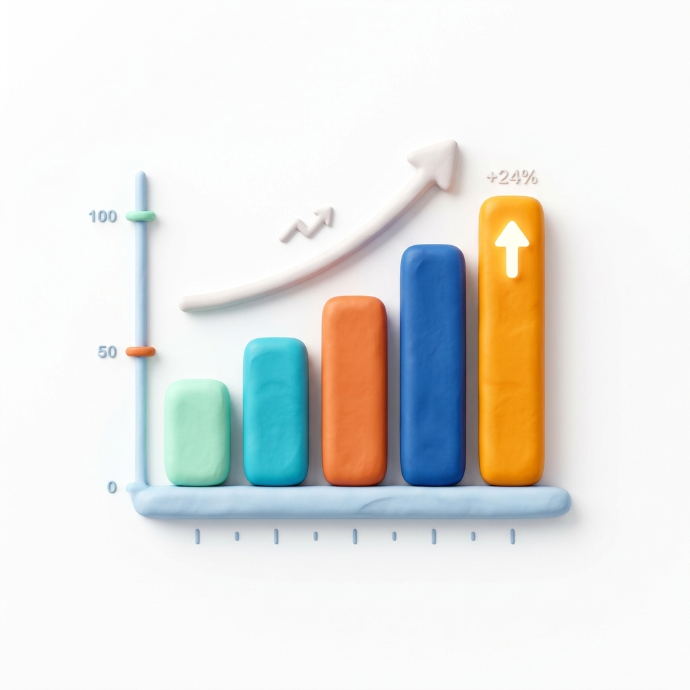

# Chapter 1 - What Is Data Analytics?



---

## Chapter Overview

This chapter exists for a reason most courses skip: **before you touch any tool, you need to understand what you are doing and why.** Data analytics is not "making charts in Excel." It is a discipline - a structured way of turning raw information into decisions. And like any discipline, it has a vocabulary, a process, a set of principles, and a history of failures that teach as much as the successes.

We will not spend this chapter reciting dictionary definitions. Instead, we will explore what analysts actually do day-to-day, how different types of analysis answer different questions, what data *is* at a fundamental level (not just "numbers in a spreadsheet"), and how to develop the mental habits that separate competent analysts from people who merely produce reports.

By the end of this chapter, you will have a framework for approaching any analytical problem - regardless of the tool, the domain, or the data. Everything in Chapters 2–12 builds on this framework.

### Prerequisites

- None. This is the starting point.

---

## Learning Objectives

By the end of this chapter, you will be able to:

1. Define data analytics and distinguish it from related disciplines (data science, data engineering, business intelligence)
2. Identify and describe the four types of analytics: descriptive, diagnostic, predictive, and prescriptive
3. Walk through the six stages of the data analytics lifecycle and explain why each matters
4. Classify data by type (quantitative vs qualitative, discrete vs continuous, and the four scales of measurement)
5. Explain why structured thinking matters more than tool proficiency
6. Recognise common cognitive biases that lead to flawed analysis

---

## 1.1 What Data Analytics Actually Is

### 1.1.1 A Working Definition

**Data analytics** is the process of examining raw data to find patterns, draw conclusions, and support decision-making.

That is the textbook definition. Here is the practical one:

**Data analytics is answering questions with evidence instead of guessing.**

Every organisation has questions:
- *Why did sales drop in Q3?*
- *Which marketing channel gives us the best return?*
- *Are we overstaffed in operations relative to output?*
- *Is this oil well underperforming compared to similar wells?*
- *Which patients are most likely to be readmitted within 30 days?*

Without analytics, these questions get answered by whoever has the loudest opinion in the meeting room. With analytics, they get answered by *what the data actually shows* - even when that contradicts assumptions.

### 1.1.2 What Analysts Do Day-to-Day

The Hollywood version of a data analyst involves staring at a screen full of scrolling green numbers. The reality is more like this:

| Time Spent | Activity |
|---|---|
| **40–50%** | **Data wrangling**: Finding data, understanding its structure, cleaning it, merging it from different sources, fixing quality issues. This is the unglamorous majority of the job. |
| **20–25%** | **Analysis**: Summarising, calculating, modelling, testing hypotheses, looking for patterns. The part people think is the whole job. |
| **15–20%** | **Communication**: Building charts, dashboards, presentations. Explaining findings to stakeholders who don't know (and don't care) about your methodology. |
| **10–15%** | **Stakeholder management**: Understanding what the business actually needs (not just what they ask for), clarifying ambiguous questions, managing expectations, iterating on feedback. |

Notice that the largest single block is *cleaning data*. This is not a failure of the profession - it reflects reality. Real-world data is messy, incomplete, inconsistent, and frequently wrong. The ability to recognise and fix data quality issues is not a side skill; it is the core skill. Chapter 4 is dedicated entirely to this.

### 1.1.3 Analytics vs Related Disciplines

Data analytics is part of a broader ecosystem. Understanding where it sits - and where it doesn't - prevents confusion and helps you communicate with other professionals:

| Discipline | Primary Question | Core Skills | Typical Output |
|---|---|---|---|
| **Data Analytics** | What happened? Why? What should we do? | Excel, SQL, Power BI, Tableau, statistics | Reports, dashboards, recommendations |
| **Data Science** | Can we predict what will happen? | Python/R, machine learning, deep statistics | Predictive models, algorithms, research papers |
| **Data Engineering** | How do we move, store, and process data at scale? | Python, SQL, cloud platforms (AWS/GCP/Azure), ETL pipelines | Data pipelines, data warehouses, APIs |
| **Business Intelligence (BI)** | How is the business performing right now? | Power BI, Tableau, SQL, data modelling | Dashboards, KPI tracking, automated reports |
| **Machine Learning Engineering** | How do we deploy models into production? | Python, MLOps, containerisation, APIs | Production ML systems |

**The overlap**: Analytics and BI share the most territory. In many organisations, they are the same role. The distinction is emphasis: BI focuses on *monitoring* (building dashboards that track ongoing metrics), while analytics focuses on *investigating* (answering specific questions, often ad hoc). In practice, most analysts do both.

**Where you are heading**: This course builds the analytics and BI skill set - specifically the Excel + Power BI stack. Chapter 12 introduces SQL and Python as the next steps toward the broader ecosystem.

---

## 1.2 The Four Types of Analytics

Not all analysis is the same. The four types form a hierarchy of increasing sophistication and value:

### 1.2.1 Descriptive Analytics - "What Happened?"

This is the foundation. Before you can explain *why* something happened, you need to know *what* happened. Descriptive analytics summarises historical data into understandable formats.

**Techniques**: Averages, totals, counts, percentages, trend lines, frequency tables, PivotTables, dashboards.

**Examples by industry**:

| Industry | Descriptive Question | Analysis |
|---|---|---|
| **Retail** | What were total sales by region last quarter? | SUM of Sales grouped by Region in a PivotTable |
| **Oil & Gas** | What was the average monthly oil production per well this year? | AVERAGE of Oil_BBL grouped by Well_ID |
| **Healthcare** | How many patients visited the emergency department each day last month? | COUNT of Patient_ID grouped by Arrival_Date |
| **Marketing** | What is our click-through rate by channel? | Clicks / Impressions grouped by Channel |
| **Finance** | Are we over or under budget this quarter? | Budget_Amount - Actual_Amount per department |

Descriptive analytics is where 80% of organisational data work lives. It is not "basic" - a well-built descriptive dashboard that the CEO checks every morning is more valuable than a sophisticated predictive model that nobody uses.

### 1.2.2 Diagnostic Analytics - "Why Did It Happen?"

Once you know *what* happened, the next question is *why*. Diagnostic analytics digs into root causes by drilling down, filtering, comparing, and correlating.

**Techniques**: Drill-downs, segmentation, correlation analysis, anomaly detection, comparing cohorts, root cause analysis (RCA).

**Examples**:

| Observation (Descriptive) | Diagnostic Question | Analysis Approach |
|---|---|---|
| Sales dropped 15% in Q3 | Why? | Segment by region, category, customer segment. Was it a specific region? A specific product? A seasonal effect? A pricing change? |
| Oil well WELL-A03 production fell sharply | Why? | Check Days_Online (was it shut down?). Compare with nearby wells. Check maintenance records. Examine the decline curve - is this normal or abnormal? |
| ER wait times increased in June | Why? | Segment by shift and day of week. Was it an understaffing issue? A surge in high-triage patients? A specific bottleneck in treatment rooms? |

**The key skill here is asking follow-up questions.** The data gives you clues, not answers. You test hypotheses by slicing the data in different ways until a pattern emerges. This is what "thinking like an analyst" means in practice - and it is a skill we will build throughout every chapter.

### 1.2.3 Predictive Analytics - "What Will Happen?"

Predictive analytics uses historical patterns to estimate future outcomes. It does not predict the future with certainty - it estimates probabilities based on past behaviour.

**Techniques**: Regression, time-series forecasting, classification models, machine learning.

**Examples**:
- Forecasting next quarter's revenue based on historical trends and seasonality
- Predicting which employees are most likely to leave (attrition modelling)
- Estimating the remaining productive life of an oil well based on its decline curve
- Predicting which patients are at high risk of readmission

**In this course**: We will touch on simple regression and trendlines in Excel (Chapters 5 and 7), and briefly introduce forecasting concepts. Deep predictive modelling requires Python or R - that is the next course, not this one. But understanding *what* predictive analytics is and *when* to use it is essential knowledge for any analyst.

### 1.2.4 Prescriptive Analytics - "What Should We Do?"

The most advanced type. Prescriptive analytics does not just predict outcomes - it recommends actions. It answers: "Given what we predict will happen, what is the optimal decision?"

**Techniques**: Optimisation, simulation, decision trees, scenario analysis, linear programming.

**Examples**:
- Given demand forecasts, how should we allocate inventory across warehouses to minimise shipping costs?
- Given drilling cost estimates and production forecasts, which wells should we prioritise for development?
- Given budget constraints, which marketing channels should receive more investment to maximise conversions?

**In this course**: Chapter 8 introduces What-If Analysis (Goal Seek, Data Tables, Scenario Manager) and Solver in Excel - these are accessible prescriptive tools. Power BI's what-if parameters (Chapter 10) also touch this territory.

### 1.2.5 The Analytics Maturity Curve

Most organisations live in the descriptive layer. The progression upward represents both increasing value and increasing difficulty:

```
                                         ┌──────────────────────┐
                                         │   PRESCRIPTIVE       │  ← "What should we do?"
                                         │   Optimisation,      │     Highest value,
                                         │   simulation         │     highest difficulty
                                    ┌────┴──────────────────────┴────┐
                                    │        PREDICTIVE              │  ← "What will happen?"
                                    │        Forecasting, ML models  │
                               ┌────┴────────────────────────────────┴────┐
                               │           DIAGNOSTIC                     │  ← "Why did it happen?"
                               │           Root cause, correlation        │
                          ┌────┴──────────────────────────────────────────┴────┐
                          │              DESCRIPTIVE                           │  ← "What happened?"
                          │              Dashboards, reports, KPIs             │     Most organisations
                          └───────────────────────────────────────────────────┘     live here
```

**Your goal is not to reach prescriptive analytics immediately.** Your goal is to master descriptive and diagnostic analytics so thoroughly that your work is genuinely useful - and to understand the upper layers well enough to know when they are needed and how to collaborate with data scientists who build them.

---

## 1.3 The Data Analytics Lifecycle

Every analytical project - from a quick question answered in 15 minutes to a six-month strategic initiative - follows the same fundamental process. The six stages are:

### 1.3.1 Stage 1: Ask - Define the Question

The most critical stage, and the most frequently skipped. A vague question produces a vague answer.

**Bad questions**:
- "Can you look at our sales data?"
- "Why is performance bad?"
- "What does the data show?"

**Good questions** (SMART framework adapted for analytics):
- "What was the percentage change in revenue by product category between Q3 2023 and Q3 2024, and which categories contributed most to the overall change?"
- "Among employees who left in the last 12 months, what distinguishes them from those who stayed - by department, tenure, performance rating, and satisfaction score?"
- "Which marketing channel has the highest conversion rate per dollar spent for the 25-34 age segment in North America?"

**What makes a question good**:

| Criterion | Bad Example | Good Example |
|---|---|---|
| **Specific** | "Look at sales" | "Compare Q3 YoY revenue by category" |
| **Measurable** | "Is marketing working?" | "What is the ROI by channel?" |
| **Answerable with data** | "Is the CEO making good decisions?" | "How does our budget variance compare to last year?" |
| **Actionable** | "Show me everything" | "Which underperforming products should we discontinue?" |
| **Time-bound** | "How are we doing?" | "What was our January-June 2024 performance vs the same period in 2023?" |

### 1.3.2 Stage 2: Collect - Gather the Data

Once you know the question, you identify what data you need and where it lives.

**Common data sources**:
- Internal databases (SQL databases, ERP systems, CRM platforms)
- Spreadsheets and CSV files (the most common format you will encounter)
- APIs (pulling data from web services)
- Web scraping (extracting data from websites)
- Third-party data providers (market data, demographic data, industry benchmarks)
- Manual collection (surveys, interviews, observations)

**In this course**: Your data is pre-prepared in the `datasets/` folder. In real work, data collection is often the hardest and most time-consuming stage. You may discover the data you need does not exist, is in a format you cannot use, or is owned by a department that will not share it.

### 1.3.3 Stage 3: Clean - Prepare the Data

Raw data is almost never ready for analysis. Cleaning (also called "data wrangling" or "data preparation") involves:

- Removing duplicate records
- Fixing formatting inconsistencies (dates, text casing, number formats)
- Handling missing values (deciding whether to fill, remove, or flag them)
- Correcting errors and typos
- Standardising categories (e.g., "US", "USA", "United States" → "United States")
- Converting data types (text stored as numbers, dates stored as text)
- Restructuring data (pivoting, unpivoting, splitting columns, merging tables)

**This is Chapter 4's entire focus.** We will use `02_sales_dirty.csv` - a dataset deliberately packed with 12 categories of quality issues - to practice every cleaning technique systematically.

### 1.3.4 Stage 4: Analyse - Find the Patterns

This is where you apply calculations, statistical methods, and logical reasoning to the cleaned data:

- Computing summary statistics (mean, median, mode, standard deviation)
- Segmenting data by categories (PivotTables, GROUP BY)
- Identifying trends over time
- Testing hypotheses ("Is this difference statistically significant, or just random noise?")
- Building models (regression, forecasting)
- Finding outliers and anomalies

**Chapters 3, 5, 6, and 8** build this skill set progressively.

### 1.3.5 Stage 5: Visualise - Communicate the Findings

Analysis without communication is wasted effort. Visualisation translates numbers into stories that decision-makers can understand and act on.

- Choosing the right chart type for the data and message
- Designing for clarity, not decoration
- Building interactive dashboards
- Writing clear annotations and titles

**Chapters 7 and 11** are dedicated to this.

### 1.3.6 Stage 6: Act - Drive Decisions

The purpose of analytics is action. A beautiful dashboard that no one uses has zero value. This stage involves:

- Presenting findings to stakeholders
- Making specific, data-supported recommendations
- Implementing changes and measuring their impact
- Creating feedback loops (did the action produce the expected result?)

**The capstone projects in Chapter 12** practice this end-to-end: from raw data to actionable recommendations.

### 1.3.7 The Lifecycle in Practice

The lifecycle is not purely linear. In practice, it is iterative:

```
    ┌────────────────────────────────────────┐
    │                                        │
    ▼                                        │
   ASK  →  COLLECT  →  CLEAN  →  ANALYSE  → │ ← (discover you need more data)
                                   │         │
                                   ▼         │
                              VISUALISE  ────┘ ← (stakeholder asks a follow-up question)
                                   │
                                   ▼
                                  ACT
```

You will frequently cycle back: analysing the data reveals a new question (back to Ask), or a stakeholder sees your visualisation and asks "What about...?" (back to Collect or Analyse).

---

## 1.4 What Is Data? - Types, Structures, and Scales

Before you can analyse data, you need to understand what you are looking at. "Data" is not one thing - it comes in different types, and the type determines which operations, functions, and charts are appropriate.

### 1.4.1 Quantitative vs Qualitative Data

| Type | Definition | Examples | What You Can Do With It |
|---|---|---|---|
| **Quantitative (Numerical)** | Data that represents amounts or measurements. Can be counted or measured. | Revenue ($12,500), temperature (72°F), patient wait time (45 min), oil production (8,500 BBL), employee age (34) | Sum, average, min, max, standard deviation, regression, histograms |
| **Qualitative (Categorical)** | Data that represents categories, labels, or descriptions. Cannot be meaningfully summed or averaged. | Region ("North America"), department ("Engineering"), ship mode ("First Class"), triage level ("Urgent"), gender ("Female") | Count, frequency tables, proportions, bar charts, pie charts |

**Why this matters**: You cannot calculate the average of "North America" and "Europe." You cannot create a histogram of customer names. If someone asks you to average a categorical column, they are asking the wrong question - or the data is miscoded.

### 1.4.2 Discrete vs Continuous Data (Quantitative Subdivision)

| Type | Definition | Examples |
|---|---|---|
| **Discrete** | Countable values, usually integers. There are gaps between possible values. | Number of orders (3), quantity sold (7), number of employees (200), number of wells (25) |
| **Continuous** | Measurable values that can take any value within a range, including decimals. | Revenue ($12,456.78), temperature (72.3°F), weight (14.7 kg), wait time (37.5 min) |

**Why this matters for charts**: Discrete data works well with bar charts (each value gets its own bar). Continuous data works well with histograms (values are grouped into bins) and line charts (showing smooth trends).

### 1.4.3 The Four Scales of Measurement

This framework (developed by psychologist Stanley Stevens in 1946) tells you *how much information* a variable carries:

| Scale | Definition | Properties | Examples | Allowed Operations |
|---|---|---|---|---|
| **Nominal** | Categories with no inherent order | Identity only | Country, department, ship mode, customer segment, well status ("Active", "Shut-in") | Count, mode, proportion |
| **Ordinal** | Categories with a meaningful order, but unequal spacing | Identity + order | Triage level (1-5), performance rating (1-5), education level (High School, Bachelor's, Master's, PhD), T-shirt size (S, M, L, XL) | Count, mode, median, rank |
| **Interval** | Numeric with equal spacing, but no true zero | Identity + order + equal intervals | Temperature in °C/°F (0°C ≠ "no temperature"), calendar year (year 0 is arbitrary), credit score | Mean, standard deviation, addition, subtraction |
| **Ratio** | Numeric with equal spacing AND a true zero | Identity + order + equal intervals + true zero | Revenue ($0 = no revenue), weight (0 kg = no weight), oil production (0 BBL = nothing produced), age, distance | All operations including multiplication, division, percentages |

**Why this matters**: The scale determines which statistics are valid:

- You **cannot** calculate the mean of nominal data ("the average country is 2.3" is nonsense)
- You **can** calculate the median of ordinal data (median triage level = 3 is meaningful)
- You **should not** say "80°F is twice as hot as 40°F" (interval scale - no true zero)
- You **can** say "$80,000 salary is twice $40,000" (ratio scale - $0 is a true zero)

> **Practical tip**: In Excel, you rarely need to think about Stevens' scales explicitly. But when someone asks you to "average the satisfaction scores" (ordinal data), you should recognise that the mean of 1-5 ratings is mathematically valid but conceptually debatable - the difference between a 2 and a 3 may not be the same as between a 4 and a 5. Reporting the median is often more defensible.

### 1.4.4 Structured vs Unstructured Data

| Type | Definition | Examples | Tools |
|---|---|---|---|
| **Structured** | Organised in rows and columns with defined types | CSV files, Excel tables, database tables | Excel, SQL, Power BI (this course) |
| **Semi-structured** | Has some organisation but not rigid rows/columns | JSON, XML, log files, emails | Python, Power Query (partially) |
| **Unstructured** | No predefined structure | Images, audio, video, free-text documents, social media posts | Python, NLP/ML tools (not this course) |

This course focuses entirely on **structured data** - tabular data organised in rows and columns. This is where Excel and Power BI excel (pun intended), and it is where the vast majority of business data analytics happens.

---

## 1.5 The Analytics Tool Landscape

Before we dive into Excel in Chapter 2, let us map out where each tool fits. This prevents the common mistake of trying to use one tool for everything.

### 1.5.1 Where Each Tool Fits

```
    ┌──────────────────────────────────────────────────────────────┐
    │                    THE ANALYTICS STACK                       │
    │                                                              │
    │   ┌─────────────┐  ┌──────────────┐  ┌─────────────────┐   │
    │   │   COLLECT    │  │   STORE      │  │   TRANSFORM     │   │
    │   │             │  │              │  │                 │   │
    │   │  APIs       │  │  SQL Server  │  │  Power Query    │   │
    │   │  Web scrape │  │  PostgreSQL  │  │  Python/pandas  │   │
    │   │  CSV export │  │  BigQuery    │  │  SQL            │   │
    │   │  Manual     │  │  Snowflake   │  │  Excel formulas │   │
    │   └──────┬──────┘  └──────┬───────┘  └────────┬────────┘   │
    │          └────────────────┼────────────────────┘            │
    │                          ▼                                  │
    │   ┌──────────────────────────────────────────────────────┐  │
    │   │                    ANALYSE                            │  │
    │   │                                                      │  │
    │   │    Excel (formulas, PivotTables, statistics)         │  │
    │   │    SQL (querying, aggregation, window functions)     │  │
    │   │    Python (pandas, scipy, scikit-learn)              │  │
    │   │    R (statistical modelling, visualisation)          │  │
    │   └──────────────────────┬───────────────────────────────┘  │
    │                          ▼                                  │
    │   ┌──────────────────────────────────────────────────────┐  │
    │   │                   VISUALISE & SHARE                   │  │
    │   │                                                      │  │
    │   │    Power BI (dashboards, interactive reports)        │  │
    │   │    Tableau (data visualisation)                      │  │
    │   │    Excel (charts, dashboards - smaller audiences)    │  │
    │   │    Looker / Metabase (embedded analytics)            │  │
    │   └──────────────────────────────────────────────────────┘  │
    └──────────────────────────────────────────────────────────────┘
```

### 1.5.2 Why We Start With Excel

Excel is the right starting tool for three reasons:

1. **Immediate feedback**: You type a formula, press Enter, and see the result. There is no compilation step, no server to start, no syntax to memorise before you can do anything useful. This tight feedback loop accelerates learning.

2. **Visual data model**: In Excel, you can *see* your data and your formulas simultaneously. When `=VLOOKUP(A2, products!A:D, 3, FALSE)` returns `#N/A`, you can click on the lookup table and visually check whether the value exists. This visibility makes debugging intuitive.

3. **Universal accessibility**: Nearly every professional has Excel installed. When you build a model or analysis in Excel, you can share it with anyone - no special software required. This pragmatic reality means Excel skills have immediate workplace value.

**Excel's limitations** (and why we add Power BI):
- Excel struggles with datasets larger than ~100,000 rows (Power BI handles millions)
- Excel dashboards are static - Power BI dashboards are interactive, refreshable, and shareable
- Excel's data model capabilities are limited - Power BI's star schema modelling is dramatically more powerful
- Excel files become unwieldy when shared among many users - Power BI reports are designed for organisational distribution

### 1.5.3 The T-Shaped Analyst

The most effective analysts are "T-shaped": deep expertise in a few tools, broad familiarity with the ecosystem.

```
           BROAD KNOWLEDGE (understand what they do, when to use them)
    ─────────────────────────────────────────────────────────────────
    SQL     Python    Tableau    Cloud     Statistics    ML/AI
                                Platforms


              │            │
              │            │
              │            │
              ▼            ▼
           Excel       Power BI

         DEEP EXPERTISE (can build production-quality work)
```

This course builds the vertical bars: deep Excel and Power BI skills. The horizontal bar - awareness of SQL, Python, cloud platforms, machine learning - is introduced in Chapter 12 and expanded in subsequent courses.

---

## 1.6 Thinking Like an Analyst

This section is arguably the most important in the chapter. Tools change. Data formats change. The ability to think clearly about data does not change.

### 1.6.1 Ask "Compared to What?"

A number in isolation means nothing. "We made $2.3 million in revenue" is a fact, not an insight. The insight comes from comparison:

- Compared to **last year**: Did revenue grow or shrink?
- Compared to **budget**: Are we on track?
- Compared to **competitors**: Is our growth rate above or below market?
- Compared to **a different segment**: Which region or product drove the change?

Every number needs context. When you build a chart, a PivotTable, or a dashboard, always include the comparison. A standalone number is decoration; a comparison is analysis.

### 1.6.2 Simpson's Paradox - The Ultimate Warning Story

Here is a scenario that has misled real analysts working with real data:

**Overall admission rates by gender** at a hypothetical university:

| Gender | Applied | Admitted | Admission Rate |
|---|---|---|---|
| Men | 2,700 | 1,198 | **44.4%** |
| Women | 1,800 | 684 | **38.0%** |

At first glance, this looks like gender discrimination - men are admitted at a higher rate. But let us break it down by department:

**Department A** (easy to get into, high acceptance rate):

| Gender | Applied | Admitted | Rate |
|---|---|---|---|
| Men | 500 | 450 | 90% |
| Women | 100 | 92 | **92%** |

**Department B** (hard to get into, low acceptance rate):

| Gender | Applied | Admitted | Rate |
|---|---|---|---|
| Men | 2,200 | 748 | 34% |
| Women | 1,700 | 592 | **34.8%** |

Within *each individual department*, women have a slightly higher admission rate! The paradox: women applied in much greater numbers to the more competitive department, dragging down their overall rate.

**The lesson**: Aggregated data can reverse the conclusion of disaggregated data. Always check whether a hidden variable (in this case, department choice) is driving the pattern. This is not an academic curiosity - it affects real decisions in hiring, healthcare, marketing, and every domain you will encounter.

### 1.6.3 Correlation Is Not Causation

This phrase is repeated so often it has become a cliché, but analysts still fall for it regularly:

- Ice cream sales and drowning deaths are strongly correlated. Ice cream does not cause drowning. Both are driven by a third variable: **hot weather** (people swim more and buy more ice cream).
- A company notices that employees who attend training sessions have higher performance ratings. Does training improve performance? Or do already-motivated employees (who would perform well anyway) self-select into training?
- Marketing spend and revenue are correlated. Does spending more money *cause* more revenue? Or does the company spend more during peak seasons when revenue would be high anyway?

**How to protect yourself**:
1. Always ask: *Is there a plausible mechanism?* (Does X logically cause Y?)
2. Always ask: *Could a third variable explain both?* (Is there a confounding variable?)
3. The only reliable way to prove causation is a **controlled experiment** (A/B test) - not observation of historical data.

### 1.6.4 Survivorship Bias

You analyse the performance of mutual funds and find that the average fund returned 12% over 10 years. Impressive? Not necessarily - because the funds that *performed badly were shut down* and are no longer in the dataset. You are only seeing the survivors.

This bias appears everywhere:
- "Companies that did X were successful" (what about companies that did X and failed?)
- "Patients who received treatment Y recovered faster" (patients healthy enough to receive treatment may have recovered faster anyway)
- "Our top-selling products have high margins" (products with high margins that didn't sell were discontinued)

**The lesson**: Always ask what is *missing* from your data, not just what is present.

### 1.6.5 Confirmation Bias

The human tendency to search for, interpret, and remember data that confirms your pre-existing beliefs - and to ignore data that contradicts them.

**In analytics, this manifests as**:
- Cherry-picking metrics that support the conclusion you already believe
- Stopping analysis when you find a result you like (instead of testing it further)
- Choosing chart types or scales that exaggerate the pattern you want to show
- Ignoring outliers that contradict your narrative

**How to protect yourself**:
1. Before analysing, write down your hypothesis *and what would disprove it*
2. Actively look for evidence against your conclusion
3. Have someone else review your analysis - fresh eyes catch biases

### 1.6.6 The Base Rate Fallacy

A medical test for a rare disease is 99% accurate. You test positive. What is the probability you actually have the disease?

Intuition says 99%. The correct answer depends on the **base rate** - how common the disease is:

- If 1 in 10,000 people have the disease (0.01% base rate):
- Out of 10,000 people tested: 1 true positive, 100 false positives (1% of 9,999 healthy people)
- Your probability of actually having the disease: 1 / 101 ≈ **1%**

The 99% accurate test gives you only a 1% chance of being sick. The base rate (how rare the disease is) dominates the calculation.

**In analytics**: When your model flags 500 transactions as fraudulent out of 1 million, and fraud is rare (0.1%), most of those 500 flags are likely false positives. Understanding base rates prevents you from overreacting to model predictions.

---

## 1.7 A Preview of the Course Datasets

To make the concepts above concrete, let us preview the primary dataset you will use throughout this course. Open `datasets/01_global_superstore_sales.csv` in Excel (File → Open → navigate to the file).

### 1.7.1 What You Will See

A table with 1,000 rows and 18 columns representing three years of multinational retail sales. Each row is one order:

| Column | Data Type | Scale | Example |
|---|---|---|---|
| `Order_ID` | Qualitative | Nominal | `ORD-0001` |
| `Order_Date` | Quantitative | Interval | `2023-06-15` |
| `Ship_Mode` | Qualitative | Nominal | `Standard Class` |
| `Customer_Name` | Qualitative | Nominal | `Maria Schmidt` |
| `Segment` | Qualitative | Nominal | `Consumer` |
| `Region` | Qualitative | Nominal | `Europe` |
| `Country` | Qualitative | Nominal | `Germany` |
| `Category` | Qualitative | Nominal | `Technology` |
| `Sales` | Quantitative | Ratio | `$1,245.67` |
| `Quantity` | Quantitative (Discrete) | Ratio | `3` |
| `Discount` | Quantitative | Ratio | `0.15` |
| `Profit` | Quantitative | Ratio | `$312.45` (can be negative) |

### 1.7.2 First Observations

Without any formulas, just by scrolling through the data, you can already start thinking analytically:

- **The data spans 3 years** (2022–2024). This means you can do year-over-year comparisons.
- **There are 5 regions** across 20 countries. Regional analysis will be meaningful.
- **Profit can be negative**. High discounts on some products cause losses. This is worth investigating.
- **Some orders have large quantities** (up to 14), while most are 1–5. Are large orders from Corporate customers?
- **Discounts range from 0 to 0.45**. What is the relationship between discount level and profitability?

These are the kinds of questions that will drive your analysis in the chapters ahead. For now, just notice them. The ability to *look at data and start asking questions* is the analyst's fundamental habit.

---

## Common Mistakes & Misconceptions

### Mistake 1: Confusing Data with Insight

**Data**: "Sales in Q3 were $1.2 million."
**Insight**: "Q3 sales dropped 18% versus last year, driven by a 35% decline in Furniture - specifically Office Chairs, where we lost 3 major corporate accounts to a competitor's price cut."

Data is the raw number. Insight is the number *in context*, with a *cause* identified and an *action* implied. Your job as an analyst is to produce insights, not data summaries.

### Mistake 2: Starting with the Tool Instead of the Question

"Let me build a PivotTable and see what comes out" is the analytical equivalent of driving without a destination. Always start with a question, then choose the tool and technique that answers it.

### Mistake 3: Treating All Data Types the Same

Averaging zip codes, summing customer IDs, or creating pie charts of continuous data are all technically possible in Excel - and all analytically meaningless. The data type determines which operations and visualisations are valid.

### Mistake 4: Assuming More Data = Better Analysis

10,000 rows of inaccurate, inconsistent data will produce worse results than 200 rows of clean, well-structured data. Quality beats quantity every time. This is why Chapter 4 (Data Cleaning) comes before Chapter 5 (Statistics).

### Mistake 5: Ignoring What the Data Cannot Tell You

Every dataset has blind spots. Your sales data does not tell you why customers bought. Your employee data does not capture office culture or team dynamics. Your oil production data does not reflect geological uncertainties. Acknowledging limitations is not weakness - it is intellectual honesty.

---


## In Simple Terms (TL;DR)

> **ELI5 (Explain Like I'm 5):**
> Data analytics is just answering questions using numbers. "Descriptive" means what happened. "Diagnostic" means why it happened. "Predictive" means what will happen next. "Prescriptive" means what we should do about it.

## Practice Exercises

### Beginner

**Exercise 1.1**: Open `datasets/01_global_superstore_sales.csv` in Excel. Without using any formulas, just by scrolling and reading, answer these questions:
- How many columns does the dataset have?
- What date range does the data cover?
- Name three quantitative columns and three qualitative columns.
- What are the possible values in the `Segment` column?

**Exercise 1.2**: Classify each of the following as descriptive, diagnostic, predictive, or prescriptive analytics:
- "Our website had 12,000 visitors last week."
- "Visitors from social media had a 2.1% conversion rate, while email visitors had 4.8% - the social media landing page may need improvement."
- "Based on the last 6 months of traffic, we expect 15,000 visitors next week."
- "To maximise conversions within our $5,000 budget, we should allocate 60% to email and 40% to search ads."

**Exercise 1.3**: For each column in the sales dataset, identify the measurement scale (nominal, ordinal, interval, or ratio). Write your answers in a list.

### Intermediate

**Exercise 1.4**: Read the Simpson's Paradox example in Section 1.6.2 again. Now imagine you are an analyst at a hospital. The overall mortality rate for Surgery Department A is 5%, and for Surgery Department B is 3%. Before concluding that Department B is safer, what confounding variables might you need to investigate? List at least three.

**Exercise 1.5**: Open `datasets/03_employee_data.csv` in Excel. Just by scrolling (no formulas), identify:
- What departments are represented?
- What is the range of salary values (roughly)?
- What column might you use to study employee retention?
- Are there any obvious patterns you notice just by looking?

### Challenge

**Exercise 1.6**: A marketing team shares this claim: "Our social media campaign was a huge success - the number of followers grew 300% in three months." Using the analytical thinking principles from Section 1.6, write three critical questions you would ask before accepting this claim. Consider: base rates, comparison points, correlation vs causation, and what the metric of "followers" actually measures in terms of business value.

**Exercise 1.7**: Design an analytical question for each of the six datasets in this course. Each question should be specific, measurable, and actionable. For example, for the oil & gas dataset: "Which wells have production decline rates more than 2 standard deviations above the basin average, suggesting potential mechanical issues that warrant inspection?"
