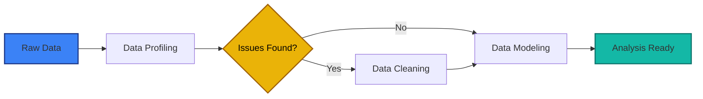

# Chapter 4 - Data Cleaning & Transformation

---

## Chapter Overview

This is the chapter most courses skip - and it is the chapter most analysts wish they had learned first. Data cleaning (also called data wrangling, data preparation, or data munging) is the process of detecting and correcting errors, inconsistencies, and structural problems in raw data before analysis.

The number you will hear everywhere: **analysts spend 60-80% of their time on data preparation.** This is not hyperbole. Real-world data arrives with misspellings, mixed date formats, numbers stored as text, duplicates, missing values, merged cells, and dozens of other issues that will produce wrong results if not addressed.

In this chapter, you will open `datasets/02_sales_dirty.csv` - a dataset we deliberately packed with 12 categories of quality issues - and systematically clean every single one. By the end, you will have a repeatable process for assessing and fixing data quality, and you will have been introduced to Power Query as a tool for building reusable, automated cleaning pipelines.

### Prerequisites

- Chapter 3 completed (you need text functions like `TRIM`, `PROPER`, `SUBSTITUTE`, and lookup functions)
- `datasets/02_sales_dirty.csv` downloaded
- `datasets/01_global_superstore_sales.csv` available (for comparison against the clean version)

---

## Learning Objectives

By the end of this chapter, you will be able to:

1. Assess a dataset for quality issues using a systematic checklist
2. Remove exact and near-duplicate records
3. Fix text inconsistencies: trailing spaces, mixed casing, special characters, typos
4. Convert text-formatted dates and numbers to proper data types
5. Handle missing values using context-appropriate strategies
6. Build data validation rules to prevent bad data from entering a spreadsheet
7. Create a Power Query pipeline that automates repeatable cleaning transformations

---

## 4.1 Why Data Cleaning Matters - The Cost of Dirty Data

### 4.1.1 What Goes Wrong

Dirty data does not just look bad - it produces **wrong answers** that lead to **wrong decisions**.

| Data Issue | Wrong Result | Business Impact |
|---|---|---|
| "Germany" and "germany" are treated as different regions | PivotTable shows two separate rows for Germany | Revenue is split, making Germany look smaller than it is |
| Date stored as text | Sorting gives "10/2/2023" before "2/1/2023" (text sort, not date sort) | Time-series analysis is incorrect |
| Numbers stored as text (with `$` and `,`) | `SUM` returns 0 because it skips text values | Financial totals are undercounted |
| 5 duplicate rows | Counts and sums are inflated by 5 extra records | Revenue is overstated |
| Missing values left as blank vs "N/A" vs "-" | `COUNTBLANK` misses "N/A" and "-" | Missing data count is underreported |
| Trailing spaces in lookup keys | `VLOOKUP("Germany ")` fails to match `"Germany"` | Lookups return `#N/A` for valid entries |

### 4.1.2 The Data Quality Assessment Checklist

Before cleaning any dataset, run through this checklist. This becomes second nature with practice.

| Check | How | What to Look For |
|---|---|---|
| **1. Row count** | `Ctrl+End`, check the Status Bar count | Does the count match what you expect? |
| **2. Column headers** | Visual inspection of row 1 | Are headers present, descriptive, and in a single row? |
| **3. Data types per column** | Select a column, check if numbers left-align (text) or right-align (number) | Mixed types within a column? |
| **4. Blank rows/columns** | `Ctrl+Down` through data - does it stop prematurely? | Blanks interrupting the data range |
| **5. Duplicates** | Data → Remove Duplicates (preview first) | Exact or near-exact duplicate rows |
| **6. Text consistency** | Sort a text column - do you see multiple versions of the same value? | "Germany", "germany", "GERMANY", "Germany " |
| **7. Date validity** | Sort a date column chronologically - does it sort correctly? | Dates that do not sort (stored as text) |
| **8. Numeric validity** | Try `=SUM()` on a numeric column - is the result correct? | Sum = 0 or error means text values present |
| **9. Missing values** | `Ctrl+G` → Special → Blanks | How many blanks? Are they truly empty or contain spaces? |
| **10. Outliers** | Sort numeric columns min-to-max | Negative quantities, impossibly large values |

---

## 4.2 Hands-On: Cleaning the Dirty Dataset

Open `datasets/02_sales_dirty.csv` in Excel. Take a moment to scroll through it and observe the chaos. Then we will fix everything systematically.

### 4.2.1 Issue 1: Blank Rows

**Diagnosis**: Press `Ctrl+End`. If the last row is higher than expected, you may have blank rows at the end. Use `Ctrl+Down` from A1 - if it stops before the last data row, there are blank rows within the data.

**Fix**:
1. Select all data: `Ctrl+Home`, then `Ctrl+Shift+End`
2. `Ctrl+G` (Go To) → Special → Blanks → OK
3. This selects all blank cells. If entire rows are blank:
4. Right-click → Delete → Entire Row

**Why blanks matter**: Blank rows break range detection, Table conversion, and `Ctrl+Down` navigation. Remove them first because subsequent cleaning steps may not find all data if blanks interrupt the range.

### 4.2.2 Issue 2: Duplicate Rows

**Diagnosis**: After removing blank rows, convert the data to a Table (`Ctrl+T`). Then check for duplicates.

**Method 1 - Remove Duplicates tool**:
1. Click any cell in the Table
2. Table Design → Remove Duplicates (or Data → Remove Duplicates)
3. Ensure all columns are checked (an exact duplicate must match on every column)
4. Click OK
5. Excel reports: "X duplicate values found and removed; Y unique values remain"

**Method 2 - Find duplicates first** (before removing, to inspect them):

Add a helper column with `COUNTIF` to count how many times each Order_ID appears:
```
=COUNTIFS([Order_ID], [@Order_ID])
```
Sort by this column descending. Any value > 1 is a duplicate. Review them before deleting.

> **Important**: Not all duplicates are errors. In some datasets, the same Order_ID might legitimately have multiple line items (different products in the same order). Always understand the grain of your data before removing duplicates.

### 4.2.3 Issue 3: Leading and Trailing Spaces

**Diagnosis**: A column sorted alphabetically shows `" Maria Schmidt"` before `"Ahmed Al-Rashid"` - the leading space pushes it to the top.

Another test: `=LEN(A2)` returns 16 for what looks like a 14-character name. Those 2 extra characters are invisible spaces.

**Fix** - `TRIM`:
```
=TRIM([@Customer_Name])
```

`TRIM` removes:
- Leading spaces (before the first character)
- Trailing spaces (after the last character)
- Extra internal spaces (reduces multiple spaces between words to one)

**Apply to all affected columns**: Create new cleaned columns, then paste-values over the originals.

**Batch fix process**:
1. Insert a new column next to `Customer_Name`
2. Enter: `=TRIM([@Customer_Name])`
3. The formula auto-fills the entire Table column
4. Copy the new column → select the original column → Paste Special → Values
5. Delete the helper column

Repeat for `City` and any other text columns with space issues.

### 4.2.4 Issue 4: Inconsistent Casing

**Diagnosis**: Sort the `Region` column. You see: `"EUROPE"`, `"Europe"`, `"asia pacific"`, `"North America"`, `"north america"`.

**Fix** - `PROPER`:
```
=PROPER([@Region])
```

| Input | Output |
|---|---|
| `"north america"` | `"North America"` |
| `"EUROPE"` | `"Europe"` |
| `"asia pacific"` | `"Asia Pacific"` |

**Caveat with PROPER**: It capitalises the first letter of *every* word. This works well for names and regions but would turn `"iPhone"` into `"Iphone"` and `"McDonald"` into `"Mcdonald"`. For cases like these, use `SUBSTITUTE` to fix specific known values.

### 4.2.5 Issue 5: Category Typos

**Diagnosis**: Sort the `Category` column. You see `"Technolgy"`, `"Furntiure"`, `"Offce Supplies"` alongside the correct spellings.

**Fix** - `SUBSTITUTE` chain:
```
=SUBSTITUTE(SUBSTITUTE(SUBSTITUTE([@Category],
    "Technolgy", "Technology"),
    "Furntiure", "Furniture"),
    "Offce Supplies", "Office Supplies")
```

**Better fix for many corrections** - Use a lookup table:

Create a reference table on a separate sheet:

| Incorrect | Correct |
|---|---|
| Technolgy | Technology |
| Furntiure | Furniture |
| Offce Supplies | Office Supplies |
| technology | Technology |
| TECHNOLOGY | Technology |

Then use:
```
=IFNA(XLOOKUP([@Category], CorrectionTable[Incorrect], CorrectionTable[Correct]), [@Category])
```

If the value is found in the correction table, replace it. Otherwise, keep the original.

### 4.2.6 Issue 6: Mixed Date Formats

**Diagnosis**: The `Order_Date` column contains dates in at least three formats:
- `"2023-06-15"` (ISO format)
- `"15/06/2023"` (DD/MM/YYYY)
- `"June 15, 2023"` (text format)

Some of these may have imported as real dates; others are text. Test: `=ISNUMBER(A2)` - TRUE for real dates, FALSE for text.

**Fix** - This requires different approaches for each format:

**For ISO text dates** (`"2023-06-15"`):
```
=DATEVALUE(A2)
```

**For DD/MM/YYYY text dates** (`"15/06/2023"`):
```
=DATE(
    RIGHT(A2, 4),
    MID(A2, FIND("/", A2) + 1, FIND("/", A2, FIND("/", A2) + 1) - FIND("/", A2) - 1),
    LEFT(A2, FIND("/", A2) - 1)
)
```

**For text month names** (`"June 15, 2023"`):
```
=DATEVALUE(A2)
```
Excel's `DATEVALUE` often handles this format automatically.

**Universal approach** - Combine with error handling:
```
=IFERROR(
    IF(ISNUMBER([@Order_Date]), [@Order_Date],
        IFERROR(DATEVALUE([@Order_Date]),
            DATE(RIGHT([@Order_Date],4),
                 MID([@Order_Date], FIND("/",[@Order_Date])+1, 2),
                 LEFT([@Order_Date], FIND("/",[@Order_Date])-1))
        )
    ),
    "PARSE ERROR"
)
```

### 4.2.7 Issue 7: Numbers Stored as Text

**Diagnosis**: The `Sales` column contains values like `"$1,234.56"` - with dollar signs and commas. Excel treats these as text, not numbers. `SUM` ignores them.

Visual clue: text numbers are **left-aligned** by default. Real numbers are **right-aligned**. You may also see a small green triangle in the top-left corner of the cell (Excel's "Number stored as text" warning).

**Fix** - `SUBSTITUTE` to remove non-numeric characters, then `VALUE` to convert:
```
=VALUE(SUBSTITUTE(SUBSTITUTE([@Sales], "$", ""), ",", ""))
```

Step by step:
1. `SUBSTITUTE([@Sales], "$", "")` → removes dollar sign: `"1,234.56"`
2. `SUBSTITUTE(..., ",", "")` → removes comma: `"1234.56"`
3. `VALUE(...)` → converts text to number: `1234.56`

**Quick fix for the green triangle**: Select all affected cells → click the warning icon → "Convert to Number". This works when the only issue is the data type, not extra characters.

### 4.2.8 Issue 8: Missing Values

**Diagnosis**: Missing data appears as:
- Truly blank cells (empty)
- `"N/A"` text
- `"n/a"` text (different casing)
- `"-"` dash

**Fix** - First, standardise all missing value indicators to blank:
```
=IF(OR([@Profit]="N/A", [@Profit]="n/a", [@Profit]="-", [@Profit]=""), "", [@Profit])
```

**Then decide how to handle blanks** - This depends on the column:

| Column | Strategy | Reasoning |
|---|---|---|
| `Customer_Name` | Flag for investigation | Names should never be missing; this indicates a data entry error |
| `Profit` | Calculate from Sales and Cost if available; otherwise leave blank | Can be derived from other data |
| `Region` | Look up from Customer_ID if mapping exists; otherwise "Unknown" | Categorical - cannot average or interpolate |
| `Quantity` | Leave blank (do not fill with 0 - zero means "no items", blank means "unknown") | 0 and unknown are different |

> **Critical principle**: Missing data is information. A blank cell means "we don't know." Zero means "we know, and it's zero." Never replace blanks with zeros unless you are genuinely certain the value is zero.

### 4.2.9 Issue 9: Inconsistent ID Formats

**Diagnosis**: The `Order_ID` column contains: `"ORD-0001"`, `"ORD0002"`, `"1003"`, `"ord-0004"`.

**Fix** - Standardise to the `ORD-XXXX` format:

```
=IF(ISNUMBER(VALUE([@Order_ID])),
    "ORD-" & TEXT([@Order_ID], "0000"),
    "ORD-" & TEXT(VALUE(SUBSTITUTE(SUBSTITUTE(UPPER([@Order_ID]), "ORD-", ""), "ORD", "")), "0000")
)
```

This handles all cases:
- Pure number (`"1003"`) → `"ORD-1003"`
- Missing hyphen (`"ORD0002"`) → `"ORD-0002"`
- Lowercase (`"ord-0004"`) → `"ORD-0004"`

### 4.2.10 Issue 10: Negative Quantities

**Diagnosis**: Sort the `Quantity` column smallest to largest. Any negative values are data entry errors (you cannot sell -3 items).

**Fix**:
```
=ABS(VALUE([@Quantity]))
```

`ABS` converts negative numbers to positive. `VALUE` ensures the result is numeric (in case Quantity was stored as text).

### 4.2.11 Issue 11: Crammed Data (Address in Name Field)

**Diagnosis**: Some `Customer_Name` cells contain: `"Maria Schmidt, 123 Main St, Munich"` - address data crammed into the name field.

**Fix** - Extract just the name (everything before the first comma):
```
=IF(ISNUMBER(FIND(",", [@Customer_Name])),
    LEFT([@Customer_Name], FIND(",", [@Customer_Name]) - 1),
    [@Customer_Name]
)
```

If a comma exists, take everything before it. Otherwise, return the full value (no comma means the name is clean).

### 4.2.12 Issue 12: Special Characters

**Diagnosis**: Product names contain `™`, `–` (em dash), and other special characters that may cause matching issues.

**Fix** - `SUBSTITUTE` for known characters:
```
=SUBSTITUTE(SUBSTITUTE([@Product_Name], "™", ""), "–", "-")
```

For a thorough clean, also apply `CLEAN()` to remove non-printable characters:
```
=CLEAN(SUBSTITUTE(SUBSTITUTE([@Product_Name], "™", ""), "–", "-"))
```

---

## 4.3 Data Validation - Preventing Dirty Data

Cleaning data is reactive. **Data validation** is proactive - it prevents bad data from being entered in the first place.

### 4.3.1 Setting Up Validation Rules

Select the cells you want to validate → Data → Data Validation.

**Common rules**:

| Rule Type | Setting | Use Case |
|---|---|---|
| **Whole Number** | Between 1 and 100 | Quantity column - no negative or zero values |
| **Decimal** | Greater than 0 | Sales, Profit - must be numeric and positive |
| **Date** | Between 1/1/2022 and 12/31/2025 | Order dates within a valid range |
| **Text Length** | Less than or equal to 50 | Customer names - prevent excessively long entries |
| **List** | Source: `"Technology,Furniture,Office Supplies"` | Category column - only allow valid categories |
| **Custom** | Formula: `=ISNUMBER(A2)` | Ensure a cell contains a number, not text |

### 4.3.2 Dropdown Lists

The most commonly used validation type. Create a cell where users can only select from predefined options:

1. Select the target cell(s)
2. Data → Data Validation → Allow: List
3. Source: Either type values separated by commas, or reference a range (e.g., `=CategoryList`)
4. Check "In-cell dropdown"

**Best practice**: Store dropdown lists in a reference sheet (e.g., "Lookups") using Named Ranges. If the list changes, update it in one place.

### 4.3.3 Custom Validation with Formulas

For complex rules, use a formula that returns TRUE (valid) or FALSE (invalid):

**No leading/trailing spaces**:
```
=LEN(A2) = LEN(TRIM(A2))
```

**Date must be a weekday**:
```
=WEEKDAY(A2, 2) <= 5
```

**Value must be unique**:
```
=COUNTIF(A:A, A2) = 1
```

### 4.3.4 Error Messages

In the Data Validation dialog, click the "Error Alert" tab to customise the message users see when they enter invalid data:

- **Stop**: Prevents entry entirely (recommended for critical fields)
- **Warning**: Warns but allows override (good for soft rules)
- **Information**: Just informs, always allows entry

---

## 4.4 Introduction to Power Query - Automated, Repeatable Cleaning

Everything we have done so far uses formulas - effective but manual. If you receive the same messy file every week (a common scenario), you would need to repeat all the cleaning steps every time.

**Power Query** solves this. It records your cleaning transformations as a series of steps (a "recipe"). When new data arrives, you refresh the query, and all transformations are reapplied automatically.

### 4.4.1 What Power Query Is

Power Query is a data transformation engine built into Excel (and Power BI). It:

- Connects to data sources (CSV, Excel files, databases, web pages, APIs)
- Records transformations as an ordered list of "Applied Steps"
- The process is generally the same regardless of the tool:

1. Identify the mess (profiling)
2. Clean and standardise (transformation)
3. Connect and shape (modeling)



This chapter covers the first two steps using Excel's built-in tools and introduces Power Query.

1. Open a new Excel workbook
2. Data → Get Data → From File → From Text/CSV
3. Navigate to `datasets/02_sales_dirty.csv`
4. In the preview dialog, click **Transform Data** (not "Load" - we want to clean first)

Power Query Editor opens, showing your data.

### 4.4.3 The Power Query Editor Interface

| Area | Purpose |
|---|---|
| **Queries pane** (left) | List of all queries in this workbook |
| **Data preview** (centre) | Shows a preview of the current data state |
| **Applied Steps** (right, under Query Settings) | The ordered list of transformations. Each step is recorded. You can delete, reorder, or edit steps. |
| **Ribbon** (top) | Home, Transform, Add Column, View tabs with transformation tools |

### 4.4.4 Basic Power Query Transformations

**Remove blank rows**:
1. Home → Remove Rows → Remove Blank Rows

**Remove duplicates**:
1. Select all columns (Ctrl+A in the preview)
2. Home → Remove Rows → Remove Duplicates

**Change column types**:
1. Click the type icon next to a column header (e.g., "ABC" for text, "123" for number)
2. Select the correct type
3. For dates: Choose Date. If it fails, the dates are in an ambiguous format - you may need to use "Using Locale" to specify the format.

**Trim and clean text**:
1. Select a text column
2. Transform → Format → Trim
3. Transform → Format → Clean (removes non-printable characters)
4. Transform → Format → Capitalize Each Word (equivalent of PROPER)

**Replace values**:
1. Select a column
2. Home → Replace Values
3. Enter: Value to Find = `"Technolgy"`, Replace With = `"Technology"`
4. Repeat for other typos

**Split columns**:
1. Select the column with crammed data (e.g., "Maria Schmidt, 123 Main St, Munich")
2. Transform → Split Column → By Delimiter → Comma
3. This creates separate columns. Rename them appropriately.

**Remove columns**:
1. Right-click a column header → Remove
2. Or: select columns to keep → right-click → Remove Other Columns

### 4.4.5 Applied Steps - Your Cleaning Recipe

Every transformation you performed is listed in the Applied Steps pane. This is the power of Power Query: the recipe is saved. When you get a new dirty file:

1. Right-click the query → Edit
2. In the first step ("Source"), change the file path to the new file
3. All subsequent steps are reapplied automatically

### 4.4.6 Loading Cleaned Data to Excel

When you are satisfied with the transformations:
1. Home → Close & Load
2. Power Query creates a new worksheet with the cleaned data as a Table
3. The Table is connected to the query - when you right-click it and select "Refresh", Power Query re-runs all steps from the original source

### 4.4.7 Power Query vs Formulas - When to Use Each

| Scenario | Use Formulas | Use Power Query |
|---|---|---|
| One-time cleaning of a small dataset | ✅ | Overkill |
| Recurring data refresh (weekly report) | Tedious, error-prone | ✅ |
| Combining multiple files | Very difficult | ✅ (designed for this) |
| Complex multi-step transformations | Hard to audit | ✅ (each step is visible and editable) |
| Non-technical users need to replicate | Formulas can be edited accidentally | ✅ (query is separate from the output) |
| Quick one-off lookups or calculations | ✅ | Overkill |

> **In this course**: We introduce Power Query here for awareness. Chapter 8 goes deep - including folder combines (merging 12 monthly files), advanced M language, and parameter queries. Power BI (Chapters 9-11) uses the same Power Query engine, so everything you learn here transfers directly.

---

## 4.5 The Clean Data Checklist - Your Quality Gate

After cleaning, verify the result against this checklist. If every item passes, your data is analysis-ready.

| Check | How to Verify | Pass Criteria |
|---|---|---|
| No blank rows | `Ctrl+Down` reaches the last row without stopping | ✅ |
| No duplicate rows | `Remove Duplicates` reports 0 removed | ✅ |
| Consistent text casing | Sort text columns - no duplicates from casing differences | ✅ |
| No leading/trailing spaces | `=LEN(A2) = LEN(TRIM(A2))` for all text cells | ✅ |
| All dates are real dates | `=ISNUMBER(date_cell)` returns TRUE for every date | ✅ |
| All numbers are real numbers | `=SUM(column)` returns a plausible total (not 0 or error) | ✅ |
| No rogue missing-value indicators | Filter each column - no "N/A", "n/a", "-", "#N/A" text values | ✅ |
| Consistent categories | Sort category columns - each value appears exactly as expected | ✅ |
| Consistent ID formats | Sort ID column - all follow the same pattern | ✅ |
| No negative quantities | `=MIN(Quantity)` ≥ 1 | ✅ |

---

## Common Mistakes & Misconceptions

### Mistake 1: Cleaning Data In Place Without a Backup

Always work on a copy. If a cleaning step goes wrong and you save over the original, the raw data is lost.

**Best practice**: Keep the original file untouched. Create a copy or use Power Query (which never modifies the source).

### Mistake 2: Replacing Blanks with Zeros

Missing ≠ zero. A blank cell in the Profit column means "we don't know the profit." Zero means "the profit was zero." These have different analytical implications. Replacing blanks with zeros inflates your denominator in averages and masks data quality issues.

### Mistake 3: Using Find & Replace Without Checking "Match Entire Cell Contents"

`Find: "NA" Replace: ""` - this removes "NA" from everywhere, including inside words like "CANADA" → "CADA". Always check "Match entire cell contents" when replacing category values.

### Mistake 4: Not Verifying After Cleaning

Running `Remove Duplicates` and assuming it worked without checking the result. Always verify: count rows before and after, spot-check specific known issues, and run the quality checklist.

### Mistake 5: Ignoring the Source of the Problem

Cleaning the same 5 issues every week? Fix the data entry process upstream. Add validation rules. Talk to the team creating the data. Cleaning is necessary but should not be a permanent band-aid over a broken data collection process.

---


## In Simple Terms (TL;DR)

> **ELI5 (Explain Like I'm 5):**
> Data is usually messy. We use tools like TRIM (removes extra spaces) and Power Query (an automatic cleaning machine) to fix bad data so we can actually use it without errors.

## Practice Exercises

### Beginner

**Exercise 4.1**: Open `datasets/02_sales_dirty.csv` in Excel. Run through the Data Quality Assessment Checklist from Section 4.1.2 and document every issue you find. How many categories of issues are there?

**Exercise 4.2**: Remove all blank rows from the dirty dataset. How many blank rows did you find?

**Exercise 4.3**: Remove exact duplicate rows. How many duplicates were there? How many unique rows remain?

**Exercise 4.4**: Use `TRIM` and `PROPER` to clean the `Customer_Name` and `Region` columns. Create helper columns with the cleaned values, then paste-values over the originals.

### Intermediate

**Exercise 4.5**: Fix the `Order_Date` column so all values are real Excel dates. This requires handling three different input formats. Verify your results by sorting chronologically.

**Exercise 4.6**: Convert the `Sales` column from text (with `$` and `,`) to real numbers. Verify by calculating `=SUM(Sales_column)` - it should return a plausible total.

**Exercise 4.7**: Standardise the `Category` column by fixing all typos. Use a correction lookup table approach (create a small reference table with incorrect → correct mappings).

**Exercise 4.8**: Build a data validation template: create a new blank workbook with headers matching the sales dataset, and apply validation rules to each column (dropdown list for Region and Category, number range for Quantity and Sales, date range for Order_Date).

### Challenge

**Exercise 4.9**: Load `datasets/02_sales_dirty.csv` into Power Query. Replicate all the cleaning steps from this chapter using Power Query's tools (not formulas). Save the query. Your Applied Steps should include at least: Remove blank rows, Remove duplicates, Trim/Clean text columns, Replace category typos, Change column types. Load the cleaned result to a new sheet.

**Exercise 4.10**: Compare your cleaned dataset against `datasets/01_global_superstore_sales.csv` (the clean source). The dirty dataset was derived from the first 70 rows of the clean dataset plus some noise. Can you verify that your cleaning produced results consistent with the original? Use VLOOKUP or XLOOKUP to match on Order_ID and compare key columns.
