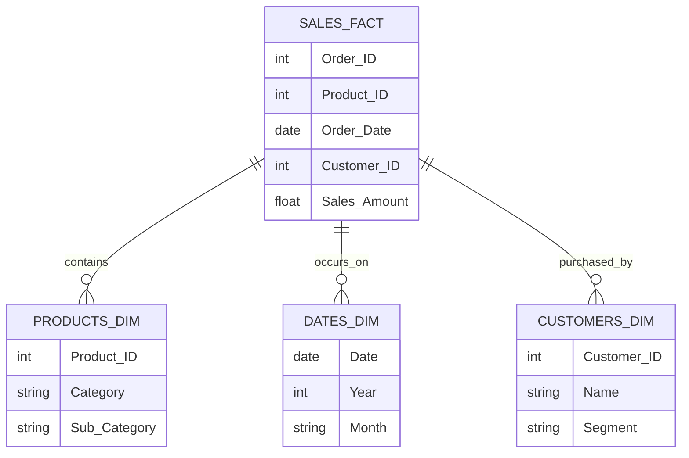

# Chapter 9 - Introduction to Power BI

---

## Chapter Overview

If Excel is the analyst's workbench, Power BI is the factory. Excel is unbeatably flexible for exploring data, prototyping calculations, and ad-hoc analysis. But when a process needs to be repeated daily, scale to 50 million rows, and be securely shared with 500 people, Excel breaks down.

Power BI solves the scale, automation, and distribution problems. It is not just a "better charting tool." It is a completely different architecture built on three pillars: **Power Query** (for data extraction and cleaning), the **Data Model** (for establishing relationships), and the **Report Canvas** (for interactive visuals).

In this chapter, we transition from spreadsheet thinking to database thinking. You will learn the Power BI interface, how to connect to data sources, and the fundamental concept that makes Power BI so powerful: the Star Schema data model.

### Prerequisites

- Microsoft Power BI Desktop installed (Windows only). It is a free download from the Microsoft Store.
- Chapter 6 (PivotTables/Data Model) and Chapter 8 (Power Query) concepts understood.
- `datasets/01_global_superstore_sales.csv` and `datasets/08_product_catalog.csv` available.

---

## Learning Objectives

By the end of this chapter, you will be able to:

1. Navigate the three primary views of Power BI Desktop: Report, Data, and Model
2. Connect Power BI to CSV and Excel files using Get Data
3. Explain the difference between Fact tables and Dimension tables
4. Design a basic Star Schema data model
5. Create relationships between tables (1-to-Many) and understand filter direction
6. Build your first interactive visual on the report canvas
7. Publish a report to the Power BI Service (conceptual overview)

---

## 9.1 The Power BI Ecosystem

Power BI is not a single program; it is an ecosystem consisting of three main parts.

### 9.1.1 Power BI Desktop (The Authoring Tool)

This is the free Windows application where analysts do the work. It is where you connect to data, build the data model, write DAX formulas, and design the reports.

**Rule of thumb**: If you are *creating* a dashboard, you use Power BI Desktop.

### 9.1.2 The Power BI Service (The Distribution Tool)

This is the cloud-based web application (`app.powerbi.com`). Once you finish building a report in Desktop, you "Publish" it to the Service.

**Rule of thumb**: If you are a manager or executive *consuming* a dashboard (viewing it, clicking filters), you use the Power BI Service via a web browser or mobile app.

### 9.1.3 The Architecture

1. **Extract & Clean**: Power Query (built into Desktop) pulls data from SQL databases, APIs, CSVs, etc.
2. **Model**: The VertiPaq engine compresses the data and manages relationships.
3. **Calculate**: DAX formulas compute metrics on the fly.
4. **Visualise**: The Report Canvas displays the interactive charts.
5. **Publish**: The file is uploaded to the Service for sharing.
6. **Automate**: A gateway connects the cloud Service back to your on-premise databases to refresh the data automatically every morning.

---

## 9.2 Getting Data into Power BI

When you open a blank Power BI Desktop file, it is useless until you connect it to data.

### 9.2.1 The "Get Data" Experience

1. Open Power BI Desktop. Close the yellow welcome screen.
2. On the Home ribbon, click **Get Data**.
3. You will see hundreds of connectors: Excel, SQL Server, Web, Salesforce, Google Analytics, Snowflake.
4. For our course, click **Text/CSV**.
5. Navigate to `datasets/01_global_superstore_sales.csv` and open it.

### 9.2.2 Load vs. Transform

You are presented with a preview window. You have two choices:
- **Load**: Dumps the data directly into the model as-is.
- **Transform Data**: Opens the Power Query Editor.

**Always click Transform Data.** Even if the data looks clean, it is best practice to verify data types and rename the query before loading.

### 9.2.3 Power Query in Power BI

If you did Chapter 8, this interface is identical to Excel's Power Query. It is the exact same engine.

1. In the Queries pane (left), rename the query from `01_global_superstore_sales` to `Sales`.
2. Check the data types. Text columns should have `ABC` in the header, numbers `123`, dates a calendar icon.
3. Get the second file: Home → New Source → Text/CSV → select `08_product_catalog.csv`.
4. Rename this query to `Products`.
5. Click **Close & Apply** (top left).

Power BI now loads the data into its internal VertiPaq engine. This may take a few seconds.

---

## 9.3 The Three Views of Power BI Desktop

Look at the far-left edge of the screen. You will see three small icons. These are the three views where you will spend all your time.

### 9.3.1 Report View (Top Icon)

The blank white canvas. This is where you drag and drop visuals (charts, maps, slicers). It is the final presentation layer.

### 9.3.2 Data View (Middle Icon)

Looks like an Excel spreadsheet. This is where you can see the actual rows and columns of data that have been loaded into the model.

**Differences from Excel**:
- You cannot type into a cell here. The data is read-only.
- If you want to change a value, you must do it in Power Query (Transform Data).
- You can create new columns using DAX (Chapter 10), but they apply to the entire column at once.

### 9.3.3 Model View (Bottom Icon)

The most important view. It shows your tables as boxes, and the lines connecting them represent relationships. If your Model view is wrong, every chart on your Report view will be wrong.

---

## 9.4 Data Modelling: The Star Schema

This is the biggest mindset shift from Excel.

In Excel, analysts strive for one massive, wide table (often created using dozens of VLOOKUPs) containing every possible column. This is called a "flat file."

In Power BI, a flat file is inefficient, slow, and hard to filter. Power BI is designed for a relational structure called the **Star Schema**.

### 9.4.1 Fact Tables

The centre of the star. Fact tables record **events** or **transactions**.
- Examples: Sales, Website Clicks, Patient Admissions, Machine Faults.
- Characteristics: Very long (millions of rows), mostly numbers (IDs, quantities, amounts), grows continuously.
- In our model: The `Sales` table is our Fact table. Every row is an order event.

### 9.4.2 Dimension Tables

The points of the star. Dimension tables contain **context** or **entities**.
- Examples: Customers, Products, Employees, Locations, Dates.
- Characteristics: Short and wide (thousands of rows, many descriptive columns), mostly text, grows slowly.
- In our model: The `Products` table is a Dimension table. Every row is a unique product.

### 9.4.3 Why the Star Schema is Better

Instead of storing the `Category` and `Unit_Cost` on all 10 million rows of the Sales table, you store a `Product_ID`. The details live in the smaller `Products` table.

**Benefits**:
1. **Speed**: Filtering a 10,000-row Products table is much faster than filtering a text column in a 10-million-row Sales table.
2. **Size**: Compression is vastly improved, keeping file sizes small.
3. **Accuracy**: If a product changes categories, you update one row in the Products table, not 50,000 rows in the Sales table.

---

## 9.5 Building Relationships

To make the Star Schema work, we must connect the Dimension tables to the Fact table.

### 9.5.1 Creating a Relationship

1. Go to the **Model View** (bottom icon on the left).
2. You should see two boxes: `Sales` and `Products`.
3. To connect them, click and drag the `Product_Name` field from the `Products` table and drop it onto the `Product_Name` field in the `Sales` table.
4. A line appears connecting them.

*(Note: In a professional database, you would use numeric `Product_ID` keys, not text names. For this course, we use names for readability).*

### 9.5.2 Understanding the Relationship Line

Double-click the line connecting the tables. You will see the Edit Relationship dialog.

**Cardinality**: It should say **1 to Many (1:*)**.
- **1 side**: The `Products` table. Every product name appears exactly *once* in this table.
- **Many (*) side**: The `Sales` table. A product can be sold *many* times.
- **Rule**: Dimension tables must have unique values for the key column. If `Products` had duplicate names, the relationship would fail.

**Cross filter direction**: It should say **Single**.
- Notice the arrow on the relationship line. It points from `Products` to `Sales`.
- This means: **Filters flow downhill from Dimensions to Facts.**
- If you filter a chart by "Technology" (from the Products table), that filter flows down the line and filters the Sales table to only show Technology sales.

> **Crucial Concept**: A relationship in Power BI is a filter-passing mechanism, not just a data join. It is how slicers and charts interact.

---

## 9.6 Building Your First Report

Let us prove that the relationship works by building a visual on the Report canvas.

### 9.6.1 The Interface

1. Go to the **Report View** (top icon).
2. On the right, you have three main panes (depending on your Power BI version, they may be flyouts):
   - **Data**: Lists your tables and fields.
   - **Visualizations**: Contains chart types and the formatting paintbrush.
   - **Filters**: For applying page-level or report-level filters.

### 9.6.2 Creating a Visual

Let us show Total Sales by Product Category.

1. **Step 1: The Dimension (The "By" field)**
   - In the Data pane, expand the `Products` table.
   - Check the box next to `Category`.
   - Power BI creates a blank table on the canvas listing the categories.
2. **Step 2: The Fact (The Metric)**
   - Expand the `Sales` table.
   - Check the box next to `Sales`.
   - The visual updates to show the sum of sales for each category.

**Why this is magical**: The `Category` text lives in the `Products` table. The `Sales` numbers live in the `Sales` table. They are physically separate. But because of the relationship line we drew, Power BI instantly cross-tabulated them. No VLOOKUP required.

### 9.6.3 Formatting the Visual

1. Ensure the table visual is selected (has a grey border with resize handles).
2. In the Visualizations pane, click the **Clustered Bar Chart** icon. The table transforms into a chart.
3. Click the **Format your visual** icon (looks like a paintbrush) in the Visualizations pane.
4. Here you apply the Data-Ink rules from Chapter 7:
   - Turn off the X-axis (we don't need the axis numbers).
   - Turn on Data labels.
   - Under Columns, change the colour to a professional blue or grey.
   - Under General → Title, change the text to "Sales by Category".

### 9.6.4 Adding Interactivity (Slicers)

1. Click on the blank white canvas (so no visual is selected).
2. In the Visualizations pane, click the **Slicer** icon (looks like a funnel with a table).
3. From the `Sales` table, drag `Region` into the "Field" well of the slicer.
4. Now click "Europe" in the slicer.
5. Watch the Bar Chart. It instantly recalculates to show only European sales.

This interactivity is the primary reason organizations move from static PowerPoint/Excel reports to Power BI.

---

## Common Mistakes & Misconceptions

### Mistake 1: Not Transforming Data Before Loading

Clicking "Load" instead of "Transform Data" when importing a CSV. If date formats are wrong, or numbers import as text, your data model is broken before you even start. Always open Power Query to verify data types.

### Mistake 2: Building Many-to-Many Relationships

Dragging a column from Table A to Table B when *both* tables contain duplicates of that value. This creates a Many-to-Many relationship, which produces unpredictable, often completely wrong filtering results. Always ensure the Dimension side has strictly unique values.

### Mistake 3: Flattening the Data

Importing a Dimension table and using Power Query to merge (join) it into the Fact table to create one massive, wide table. "I'm used to VLOOKUP, so I want everything in one place." This destroys Power BI's performance and breaks cross-filtering. Trust the Star Schema.

### Mistake 4: Bi-directional Filtering

Changing the Cross filter direction from "Single" to "Both" because a filter isn't working the way you want. This allows filters to flow "uphill" from Fact to Dimension, which can cause massive performance issues and ambiguous filtering paths in complex models. Leave it on Single unless you know exactly what you are doing.

---

## In Simple Terms (TL;DR)

> **ELI5 (Explain Like I'm 5):**
> Power BI is like Excel on steroids. Instead of one giant messy sheet, we use a "Star Schema" - one central table for events (Sales) surrounded by smaller tables for details (Products, Customers). It's much faster.

## Practice Exercises

### Beginner

**Exercise 9.1**: Open Power BI Desktop. Connect to `datasets/03_employee_data.csv`. Open Transform Data, verify the data types (especially Salary as a whole number and Hire_Date as a date), and Load it into the model.

**Exercise 9.2**: Go to the Data view and explore the employee data. Can you sort the Salary column descending just to see the highest earners?

**Exercise 9.3**: Go to the Report view. Create a Clustered Column chart showing `Salary` (Values) by `Department` (X-axis). Note: Power BI defaults to `Sum of Salary`. Is Sum the best metric here, or Average? Change it by clicking the down arrow next to Salary in the Visualizations pane and selecting Average.

### Intermediate

**Exercise 9.4**: Build a Star Schema. Start a new Power BI file. Load `01_global_superstore_sales.csv` and `08_product_catalog.csv`. Go to the Model view. Delete the automatic relationship if Power BI created one incorrectly. Manually create a relationship linking `Product_Name` in both tables. Verify it is a 1-to-Many relationship pointing from Products to Sales.

**Exercise 9.5**: Build an interactive dashboard layout. Add a text box at the top for a title: "Executive Sales Summary". Below it, create three visuals:
1. A Line chart showing Sales by Order_Date (Power BI will automatically create a date hierarchy; use Year and Month).
2. A Bar chart showing Sales by Category (from the Products table).
3. A Slicer for Segment.
Test the slicer to ensure both charts update.

### Challenge

**Exercise 9.6**: Data Model problem solving. You have Sales data (Fact) and you want to analyze it by Marketing Campaign. You have a `Campaign_ID` in the Sales table, but the descriptive names of the campaigns are in the `05_marketing_campaigns.csv` file.
1. Load both files into a new Power BI Desktop model.
2. In the Model view, create the relationship between them. Which table is the 1 side? Which is the Many side? What column should you link them on?
3. Create a pie chart (yes, a pie chart, assuming there are only a few campaigns) showing total Sales by Campaign Name. Does the relationship work?
